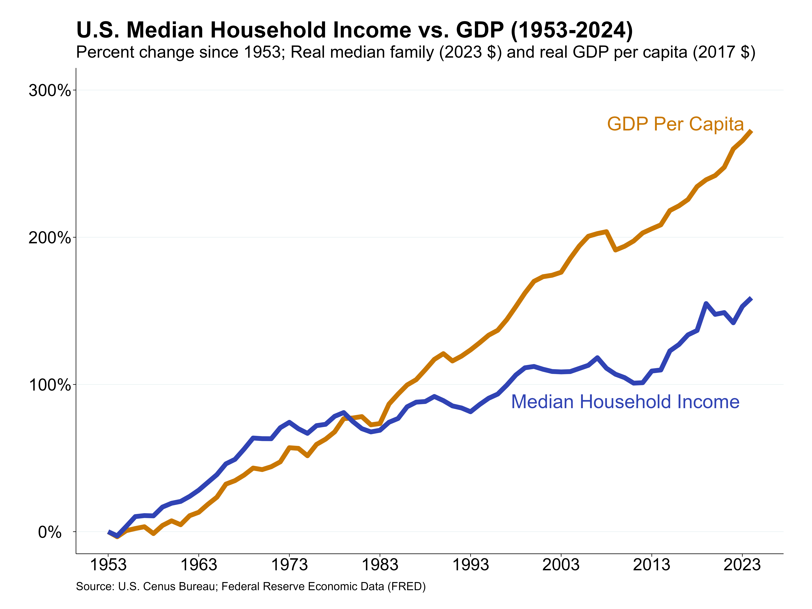
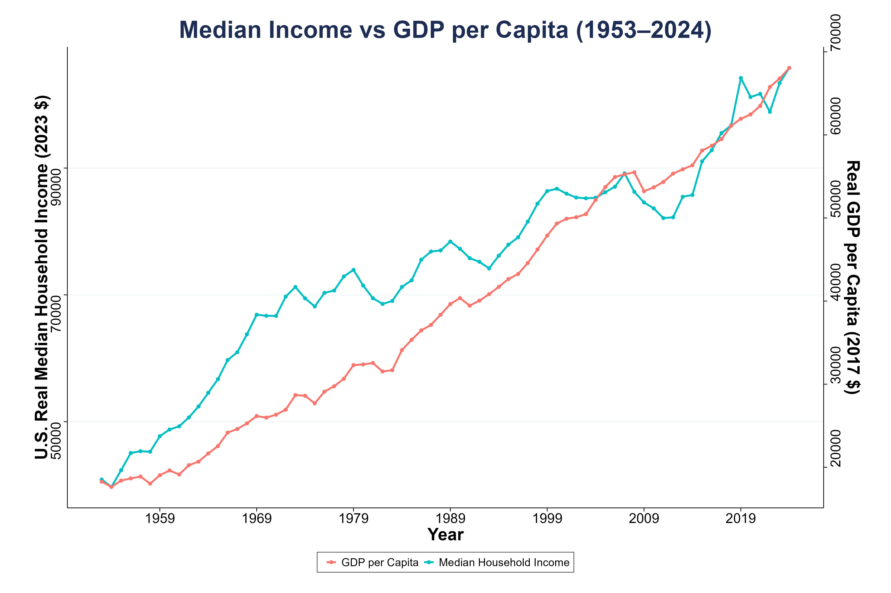

# Cato Institute Data Research Lab
### Carol Xu

2 February 2026

## Have middle-class incomes declined since the 1950s?

Real median household income in the United States has risen from $40,870 in 1953 to $105,800 in 2024 (158.9%). However, this growth has been outpaced by the growth in GDP per capita, which has increased from $18,268 to $68,065 per person (272.6%). This indicates that although incomes have increased, the average American household now holds a smaller share of the U.S. economy. 

### Data sources:
1. U.S. Census Bureau - Real Median Family Income in the United States (FRED)
    - Units: 2023 CPI adjusted dollars
2. U.S. Bureau of Economic Analysis - Real gross domestic product per capita (FRED)    
    - Units: 2017 Dollars

Since the two datasets are adjusted by different inflation deflators, both real income and GDP were indexed to compare relative growth over time, from 1953 to 2024. 

